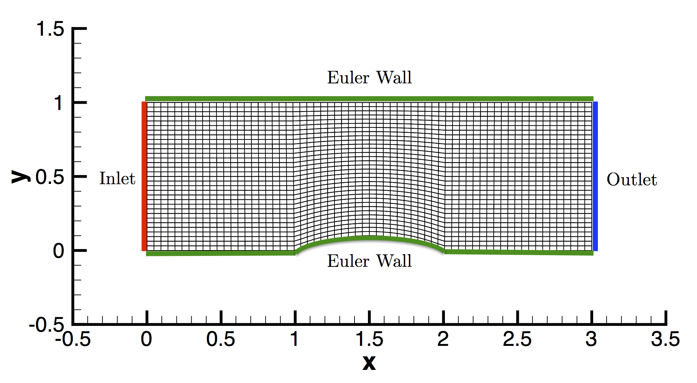
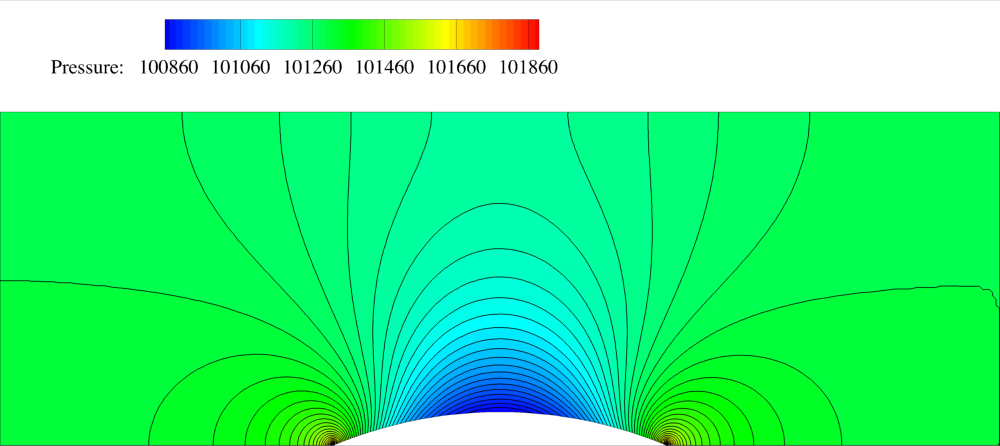

## Goals

Upon completing this tutorial, the user will be familiar with performing a simulation of internal, inviscid flow through a 2D geometry. The specific geometry chosen for the tutorial is a channel with a bump along the lower wall. Consequently, the following capabilities of SU2 will be showcased in this tutorial:
- Steady, 2D Euler equations 
- Multigrid
- JST convective scheme in space (2nd-order, centered)
- Euler implicit time integration
- Inlet, Outlet, and Euler Wall boundary conditions

The intent of this tutorial is to introduce a simple, inviscid flow problem and to explain how boundary markers are used within SU2. This tutorial is especially useful for showing how an internal flow computation can be performed using the inlet and outlet boundary conditions.

## Resources

You can find the resources for this tutorial in the folder [Inviscid_Bump](https://github.com/su2code/su2code.github.io/tree/master/Inviscid_Bump) in the [project website repository](https://github.com/su2code/su2code.github.io). You will need the mesh file [mesh_channel_256x128.su2](../../Inviscid_Bump/mesh_channel_256x128.su2)
and the config file [inv_channel.cfg](../../Inviscid_Bump/inv_channel.cfg).

## Tutorial

The following tutorial will walk you through the steps required when solving for the flow through the channel using SU2. It is assumed you have already obtained and compiled SU2_CFD. If you have yet to complete these requirements, please see the [Download](/docs/Download/) and [Installation](/docs/Installation/) pages.

## Background

This example uses a 2D channel geometry that features a circular bump along the lower wall. It is meant to be a simple test in inviscid flow for the subsonic inlet and outlet boundary conditions that are required for an internal flow calculation. The geometry is adapted from an example in Chapter 11 of Numerical Computation of Internal and External Flows: The Fundamentals of Computational Fluid Dynamics (Second Edition) by Charles Hirsch.

## Problem Setup

This tutorial will solve the for the flow through the channel with these conditions:
- Inlet Stagnation Temperature = 288.6 K
- Inlet Stagnation Pressure = 102010.0 N/m2
- Inlet Flow Direction, unit vector (x,y,z) = (1.0, 0.0, 0.0) 
- Outlet Static Pressure = 101300.0 N/m2

There is also a set of inlet/outlet conditions for transonic flow available in the config file (commented out by default).

### Mesh Description

The channel is of length 3L with a height L and a circular bump centered along the lower wall with height 0.1L. For the SU2 mesh, L = 1.0 was chosen, as seen in the figure of the mesh below. The mesh is composed of quadrilaterals with 256 nodes along the length of the channel and 128 nodes along the height. The following figure contains a view of the mesh topology (a coarser mesh is shown for clarity).


Figure (1): The computational mesh with boundary conditions highlighted.

The boundary conditions for the channel are also highlighted in the figure. Inlet, outlet, and Euler wall boundary conditions are used. The Euler wall boundary condition enforces flow tangency at the upper and lower walls. 

It is important to note that the subsonic inlet and outlet boundary conditions for compressible flow are based on characteristic information, meaning that only certain flow quantities can be specified at the inlet and outlet. In SU2, there are presently two inlet types that allow for the imposition of stagnation conditions or mass flow. For the stagnation conditions inlet, the stagnation temperature, stagnation pressure, and a unit vector describing the incoming flow direction must all be specified For the mass flow inlet, the density and velocity vector are specified.  

At a subsonic exit boundary in compressible flow, only the static pressure is required. These options are explained in further detail below under configuration file options. If there are multiple inlet or outlet boundaries for a problem, this information can be specified for each additional boundary by continuing the lists under the `MARKER_INLET` or `MARKER_OUTLET` specifications.

### Configuration File Options

Several of the key configuration file options for this simulation are highlighted here. Here we explain some details on markers and boundary conditions:

```
% -------------------- BOUNDARY CONDITION DEFINITION --------------------------%
%
% Euler wall boundary marker(s) (NONE = no marker)
MARKER_EULER= ( upper_wall, lower_wall )
%
% Inlet boundary type (TOTAL_CONDITIONS, MASS_FLOW)
INLET_TYPE= TOTAL_CONDITIONS
%
% Inlet boundary marker(s) (NONE = no marker) 
% Format: ( inlet marker, total temperature, total pressure, flow_direction_x,
%           flow_direction_y, flow_direction_z, ... ) where flow_direction is
%           a unit vector.
MARKER_INLET= ( inlet, 288.6, 102010.0, 1.0, 0.0, 0.0 )
%
% Outlet boundary marker(s) (NONE = no marker)
% Format: ( outlet marker, back pressure (static), ... )
MARKER_OUTLET= ( outlet, 101300.0 )
```

The 4 different boundary markers in the computational grid must have an accompanying string name. These marker names (upper_wall, lower_wall, inlet, and outlet for this case) are each given a specific type of boundary condition in the config file. For the inlet and outlet boundary conditions, the additional flow conditions are specified directly within the configuration option. 

The inlet boundary condition type is controlled by the `INLET_TYPE` option, and the total condition type is the default. The format for the total condition inlet boundary condition is (marker name, inlet stagnation pressure, inlet stagnation pressure, x-component of flow direction, y-component of flow direction, z-component of flow direction), where the final three components make up a unit flow direction vector (magnitude = 1.0). In this problem, the flow is exactly aligned with the x-direction of the coordinate system, and thus the flow direction vector is `(1.0, 0.0, 0.0)`.  The outlet boundary format is (marker name, exit static pressure). 

```
% ------------------------ SURFACES IDENTIFICATION ----------------------------%
%
% Marker(s) of the surface to be plotted or designed
MARKER_PLOTTING= ( lower_wall )
%
% Marker(s) of the surface where the functional (Cd, Cl, etc.) will be evaluated
MARKER_MONITORING= ( upper_wall, lower_wall )
```

Any boundary markers that are listed in the `MARKER_PLOTTING` option will be written into the surface solution vizualization file. Any surfaces on which an objective is to be calculated, such as forces or moments, must be included in the `MARKER_MONITORING` option.

Some basic options related to time integration:

```
% Time discretization (RUNGE-KUTTA_EXPLICIT, EULER_IMPLICIT, EULER_EXPLICIT)
TIME_DISCRE_FLOW= EULER_IMPLICIT
% 
% Courant-Friedrichs-Lewy condition of the finest grid
CFL_NUMBER= 50.0
%
% Multi-Grid Levels (0 = no multi-grid)
MGLEVEL= 3    
```

In general, users can choose from explicit or implicit time integration schemes. For the majority of problems, implicit integration is recommended for its higher stability and better convergence potential, especially for steady problems. Implicit methods typically offer stability at higher CFL numbers, and for this problem, Euler Implicit time integration with a CFL number of 50 is chosen. Convergence is also accelerated with three levels of multigrid. We will discuss some of these options in later tutorials.

Setting the convergence criteria:
```
% Convergence criteria (CAUCHY, RESIDUAL)
CONV_CRITERIA= RESIDUAL
%
% Residual reduction (order of magnitude with respect to the initial value)
RESIDUAL_REDUCTION= 6
%
% Min value of the residual (log10 of the residual)
RESIDUAL_MINVAL= -12
%
% Start convergence criteria at iteration number
STARTCONV_ITER= 10
```

There are three different types of criteria for terminating a simulation in SU2: running a specified number of iterations (`EXT_ITER` option), reducing the residual of the density equation by a specified order of magnitude (or reaching a specified lower limit), or by converging an objective, such as drag, to a certain tolerance. The most common convergence criteria is the `RESIDUAL` option which is used in this tutorial by setting the `CONV_CRITERIA`. The `RESIDUAL_REDUCTION` option controls how many orders of magnitude reduction in the density residual are required for convergence, and `RESIDUAL_MINVAL` sets the minimum value that the residual is allowed to reach before automatically terminating. The user can set a specific iteration number to use for the initial value of the density residual using the `STARTCONV_ITER` option. For example, the simulation for the inviscid channel will terminate once the density residual reaches a value that is 6 orders of magnitude smaller than its value at iteration 10. Note, however, that SU2 will always use the maximum value of the density residual to compute the relative reduction, even if the maximum value occurs after the iteration specified in `STARTCONV_ITER`.

### Running SU2

The channel simulation for the 256x128 node mesh is relatively small, so this case will be run in serial. To run this test case, follow these steps at a terminal command line:
 1. Move to the directory containing the config file ([inv_channel.cfg](../../Inviscid_Bump/inv_channel.cfg)) and the mesh file ([mesh_channel_256x128.su2](../../Inviscid_Bump/mesh_channel_256x128.su2)). Make sure that the SU2 tools were compiled, installed, and that their install location was added to your path.
 2. Run the executable by entering 
 
    ```
    $ SU2_CFD inv_channel.cfg
    ```
     
     at the command line.
 3. SU2 will print residual updates with each iteration of the flow solver, and the simulation will finish after reaching the specified convergence criteria.
 4. Files containing the results will be written upon exiting SU2. The flow solution can be visualized in ParaView (.vtk) or Tecplot (.dat for ASCII). To visualize the flow solution in ParaView update the `OUTPUT_FORMAT` setting in the configuration file.

### Results

The following images show some SU2 results for the inviscid channel problem.


Figure (2): Mach number contours for the 2D channel.


Figure (3): Pressure contours for the 2D channel.
