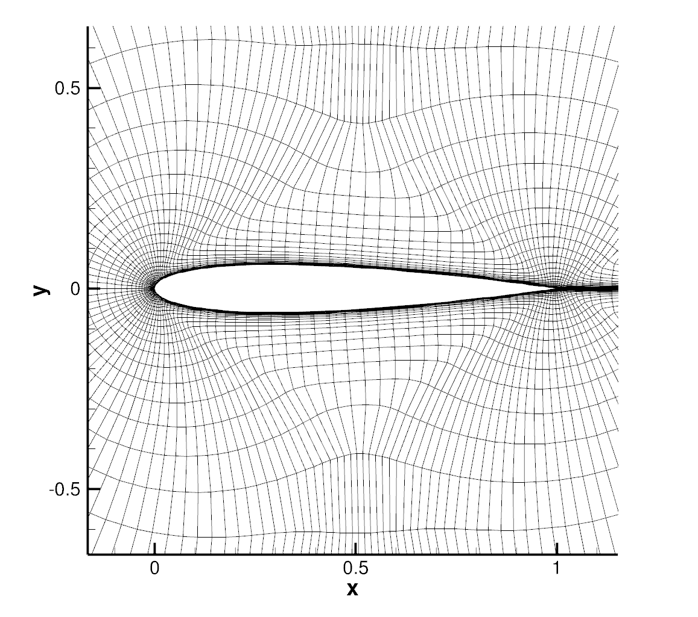
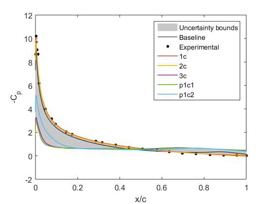
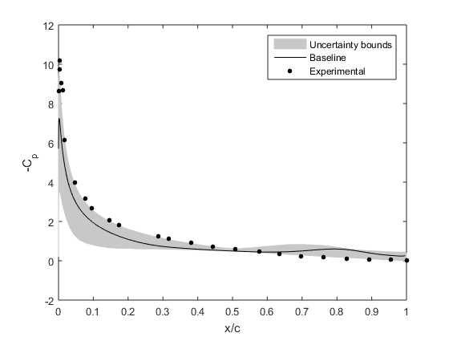
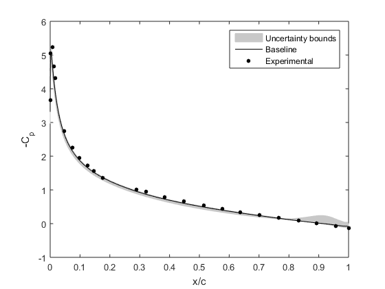
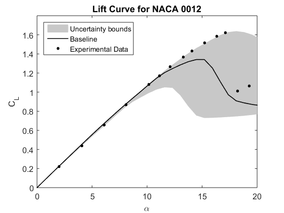

## Goals

This tutorial covers the EQUiPS (Enabling Quantification of Uncertainty in Physics-based Simulations) module implemented in SU2 that allows for the estimation of epistemic uncertainties arising from structural assumptions in RANS turbulence closures. The test case chosen for this is the NACA0012 airfoil where we will estimate the uncertainty in surface C<sub>P</sub> predictions at two different angles of attack. Instructions for running an angle of attack sweep to estimate the uncertainty in C<sub>L</sub> predictions are also provided. The following capabilities of SU2 will be showcased in this tutorial:

- Uncertainty Quantification (UQ) of the SST Turbulence Model
- compute_uncertainty.py: automates the UQ module
- Manual configuration options to perform UQ analysis


## Resources

The resources for this tutorial can be found in the [UQ_NACA0012](https://github.com/su2code/su2code.github.io/tree/master/UQ_NACA0012) directory in the [project website repository](https://github.com/su2code/su2code.github.io). You will need the configuration file ([turb_NACA0012_uq.cfg](../../UQ_NACA0012/turb_NACA0012_uq.cfg)) and the mesh file ([mesh_n0012_225-65.su2](../../UQ_NACA0012/mesh_n0012_225-65.su2)). Note that this tutorial directory contains 5 other configuration files as well. These are for running the perturbations manually and details for that will be covered in the Running Individual Perturbations section.

Details about the methodology and implementation in SU2 is available as a [pre-print](https://arxiv.org/pdf/1803.00725.pdf)

## Tutorial

The following tutorial will walk you through the steps required when using the EQUiPS module for estimating uncertainties in CFD predictions arising due to assumptions made in turbulence models. The tutorial will also address procedures for both serial and parallel computations. To this end, it is assumed you have already obtained and compiled SU2_CFD. If you have yet to complete these requirements, please see the [Download](/docs/Download/) and [Installation](/docs/Installation/) pages.


### Background

This test case is for the NACA 0012 airfoil in viscous flow. This is a simple 2D geometry that stalls, and exhibits seperated flow, at high angles of attack. It is a ubiquitous geometry that has significant amounts of experimental data available that allows for the comparison of lower fidelity RANS CFD simulations, to the higher fidelity wind tunnel tests that have been conducted. 

The EQUiPS module uses the Eigenspace Perturbation methodology to estimate the uncertainties arising from RANS turbulence closures. This involves perturbing the eigenvalues and eigenvectors of the Reynolds stress tensor to explore the extremal states of componentality, and turbulence production of the flow. Utilizing 5 differently perturbed flow simulations, in addition to a baseline unperturbed flow simulation, the module provides interval estimates on the quantities of interest. Each perturbed simulation results in a different realization of the flow field, and by extension, a different realization of the QoIs. The interval bounds are formed by the maximum and minimum values the QoIs resulting from these 6 simulations.

It is important to note here that these bounds are not informed by the use of any high fidelity data. They represent the range of possible values for the QOIs. They do not assume any probability distribution within them.


### Problem Setup

This problem will solve the flow past the airfoil with these conditions:
- Freestream Temperature = 300 K
- Freestream Mach number = 0.15
- Angle of attack (AOA) = 15deg 
- Reynolds number = 6.0E6
- Reynolds length = 1.0 m

Although this particular case simulates flow at 15deg, the same simulation can be run at varying angles of attack. The results section presents analyses from performing the simulations at a range of angles of attack which allows the exploration of the various flow regimes that occur. At low angles of attack, the flow stays attached and RANS simualtions are quite accurate in predicting the flow. At higher angles of attack, the onset of stall causes flow seperation which leads to inaccuracies in flow predictions.

### Mesh Description

The mesh used is a structured C-grid. The farfield boundary extends 500c away from the airfoil surface. The airfoil surface is treated as a Navier-Stokes wall (non-slip). This can be seen in Figure (1).


Figure (1): Zoomed in view of mesh near airfoil.

### Running the Module

The module is built to be *versatile*, such that it can be used by experts and non-experts alike. A simple Python script abstracts away the details of the perturbations (componentality, eigenvector permutations) and sequentially performs the perturbed simulations. The script requires a mesh and configuration file that are identical to ones that are needed to run a baseline RANS CFD simulation. For smooth operation, it is best to have performed the baseline simulation with SU2 and have achieved sufficient convergence. This ensures that the configuration file and mesh are well posed, and, if run through the Python script, can provide converged, perturbed simulations. Details in the next section on Configuration File Options are not required to run the Python script. Unless there is a need to perform the perturbations individually, you can move to the **Running SU2** section. 

 
### Configuration File Options

If there is a need to perform the perturbations individually (for example to run them in parallel, or on different machines), configuration options need to be set to specify the kind of perturbation to perform. 

```
% ------------------- UNCERTAINTY QUANTIFICATION DEFINITION -------------------%
%
% Using uncertainty quantification module (YES, NO). Only available with SST
USING_UQ= YES
%
% Eigenvalue perturbation definition (1, 2, or 3)
UQ_COMPONENT= 1
%
% Permuting eigenvectors (YES, NO)
UQ_PERMUTE= NO
%
% Under-relaxation factor (float [0,1], default = 0.1)
UQ_URLX= 0.1
%
% Perturbation magnitude (float [0,1], default= 1.0)
UQ_DELTA_B= 1.0

```

1. USING_UQ: Boolean that ensures EQUiPS module is used. This is required to be set to YES. 
2. UQ_COMPONENT: Number that specifies the eigenvalue perturbation to be performed
3. UQ_PERMUTE: Boolean that indicates whether eigenvector permutation needs to be performed
4. URLX: Sets the under-relaxation factor used in performing perturbation. This option need not be changed unless the perturbation simulations are unstable. URXL can be in the range of [0; 1] and it's default value is 0:1. This should not be set to < 0:05 as the perturbations may not be completed
by convergence.
5. UQ_DELTA_B: Sets the magnitude of perturbation. This option should not be touched without having read the references on the Eigenspace Perturbation methodology. UQ_DELTA_B [0; 1] and it's default value is 1.0. The default value corresponds to a full perturbation and is required to correctly characterize the epistemic uncertainties

Specific combinations of UQ_COMPONENT and UQ_PERMUTE are required to perform the 5 perturbed simulations needed to characterize the interval estimates on the QOIs. The combinations are highlighted in Table (1)

| Perturbation | UQ_COMPONENT | UQ_PERMUTE |
|--------------|----------------|---------|
|1c | 1 | NO |
|2c | 2 | NO |
|3c | 3 | NO |
|p1c1 | 1 | YES |
|p1c2 | 2 | YES |

Table (1): Combination of options required to perform each perturbation

The correct combinations of these options are also included in the additional configuration files included in this tutorials directory: [UQ_NACA0012](https://github.com/su2code/su2code.github.io/tree/master/UQ_NACA0012). These files are named turb_NACA0012_uq_PERTURBATION.cfg, where the keyword PERTURBATION is replaced with the names included in Table (1).

For the sake of uniformity and clarity, it is suggested to perform perturbed simulations in subdirectories named according to the naming convention mentioned in the table. For example, the configurtaion file [turb_NACA0012_uq_1c.cfg](../../UQ_NACA0012/turb_NACA0012_uq.cfg) (which performs the 1c perturbation), and the mesh file should be moved to a sub-directory 1c/. The CFD simulation should be performed within this directory. This keeps with the convention used by the python script. 


### Running SU2

For this test case, the baseline flow solution and restart files are provided. For any other case, it is imperative that before running the perturbed simulations, the baseline unperturbed simulation is run and the solution is well converged. This ensures that the configuration file and the mesh are well posed and will result in converged perturbed simulations as well. Instructions for running the perturbed simulations for this test case are given here for both cases, if you would like to use the Python script, or if you would like to perform the simulations individually. 

#### Python Script

To run this test case, follow these steps at a terminal command line:
 1. Move to the directory containing the config file ([turb_NACA0012_uq.cfg](../../UQ_NACA0012/turb_NACA0012_uq.cfg)) and the mesh file ([mesh_n0012_225-65.su2](../../UQ_NACA0012/mesh_n0012_225-65.su2)). Make sure that the SU2 tools were compiled, installed, and that their install location was added to your path. 
 2. To run the executable in series, enter in the command line:
      
    ```
    $ compute_uncertainty.py -f turb_NACA0012_uq.cfg
    ```
 3. If running in parallel, make sure that the SU2 tools were compiled with parallel support, installed, and that their install location was added to your path. To run the simulation using `NP` number of processors, enter the following in the command line:
      
    ```
    $ compute_uncertainty.py -f turb_NACA0012_uq.cfg -n NP
    ```
 4. The python script will create a sub-directory for each simulation and run the simulations sequentially. It will also print residual updates with each iteration of the flow solver. Each perturbed simulation will terminate after reaching the specified convergence criteria. As soon as one simulation is completed, the next one will begin in a new sub-directory. 
 5. Files containing the results will be written at the end of each perturbed simulation in the respective subdirectory. The flow solutions can be visualized in ParaView (.vtk) or Tecplot (.dat for ASCII).

#### Individual Perturbed Simulations

To run each individual perturbed simulation seperately, configuration options for each simulation need to be defined. For the purposes of this tutorial, the configuration files for each of the perturbed simulations is provided in the [UQ_NACA0012](https://github.com/su2code/su2code.github.io/tree/master/UQ_NACA0012) directory in the [project website repository](https://github.com/su2code/su2code.github.io). The following steps walk through the process of running one of these perturbations (1c). These steps need to be repeated for each of the perturbations to fully define the interval bounds predicted by the methodology. Follow these steps in the command line. 
 1. Move to the directory containing the config file ([turb_NACA0012_uq_1c.cfg](../../UQ_NACA0012/turb_NACA0012_uq_1c.cfg)) and the mesh file ([mesh_n0012_225-65.su2](../../UQ_NACA0012/mesh_n0012_225-65.su2)). 
 2. Create a sub-directory named `1c` (named after the 1st perturbation) and copy the configuration file and mesh file within this directory, and move to this sub-directory.
 4. If running in series, make sure that the SU2 tools were compiled, installed, and that their install location was added to your path. Enter the following in the command line: 

 	```
    $ SU2_CFD turb_NACA0012_uq.cfg
    ```

 5. If running in parallel, make sure that the SU2 tools were compiled with parallel support, installed, and that their install location was added to your path. Run the python script which will automatically call SU2_CFD and will perform the simulation using `NP` number of processors by entering in the command line:

    ```
    $ parallel_computation.py -n NP -f turb_ONERAM6.cfg
    ```

 6. SU2 will print residual updates with each iteration of the flow solver, and this first perturbed simulation will terminate after reaching the specified convergence criteria. 
 7. Files containing the results will be written upon exiting SU2. 
 8. Repeat the steps for each of the perturbations, creating appropriately named sub-directories.  

### Results

In order to obtain the interval bounds of a QOI, all 6 instantiations of the flow solution (1 baseline and 5 perturbed) must be analyzed. To illustrate how the bounds are formed, we use the example of the Cp distribution along the upper surface of the airfoil. In Figure (2a) the Cp distributions of each perturbed simulation is plotted along with the baseline simulation, experimental data, and the uncertainty bounds. In Figure(2b), only the individual perturbation data is hidden. 





Figure (2): Cp distribution along upper surface for the NACA0012 airfoil at 15deg AOA (a) with individual perturbations included, (b) with only the resulting interval bounds. 

The uncertainty bounds are formed by a union of all the states the QOI predicted by the module. It is interesting to see the bounds are larger in areas with correspondingly large discrepancy between the baseline simulation, and the experimental data. 

At an angle of attack of 10deg, the baseline RANS model is able to accurately predict the Cp distribution. If the UQ module is run at this angle, it is seen that the uncertainty bounds are much smaller. This case can be run simply using the steps as above, only changing the AOA option for the files. This is illustrated in Figure(3)



Figure (3): Cp distribution along upper surface for the NACA0012 airfoil at 10deg AOA with predicted interval bounds

Similarly, if the module is run for a number of angles of attack, the predicted lift curve can be plotted. This showcases the robustness of the model in different flow situations. Figure(4) illustrates the results from a angle of attack sweep from 0 to 20 degrees. 




Figure (4): Lift Curve of the NACA0012 with interval bounds predicted by the EQUiPS module. 
