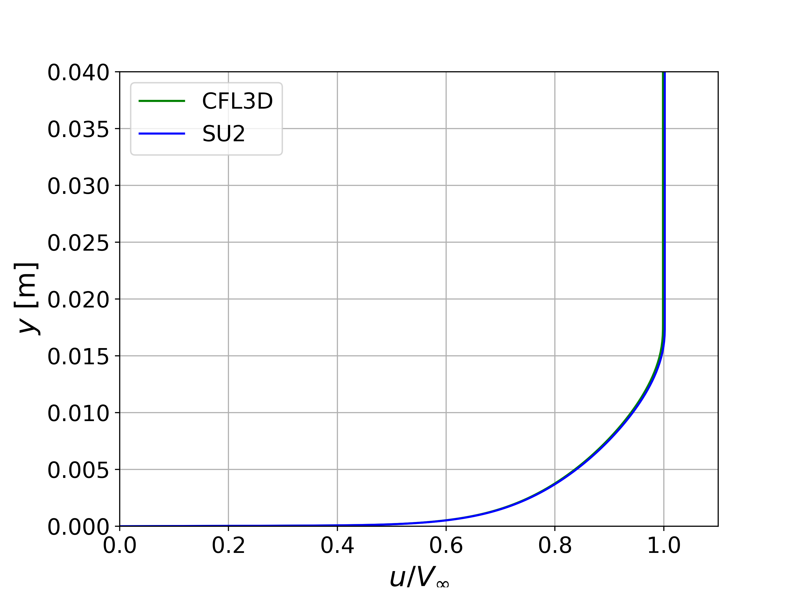
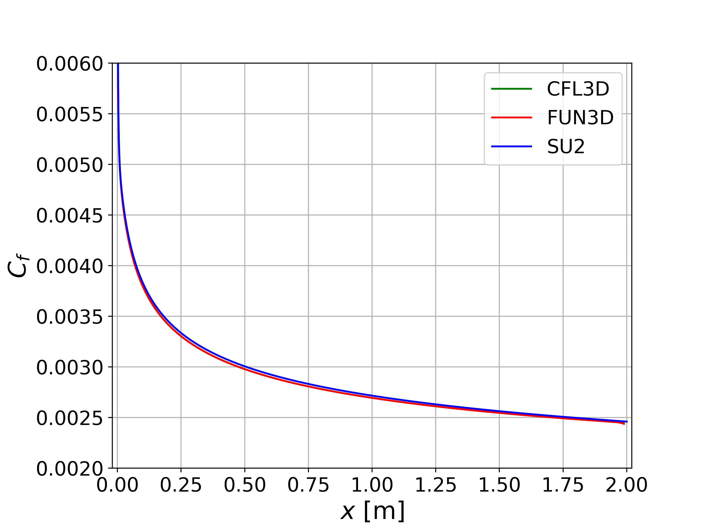
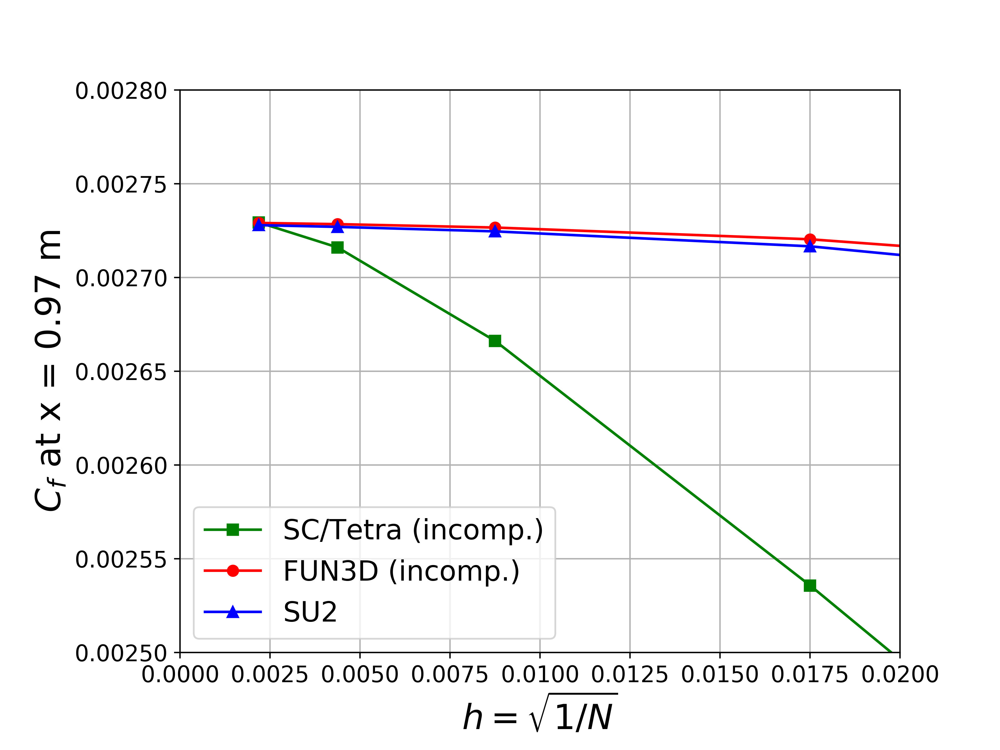

## Goals

Upon completing this tutorial, the user will be familiar with performing a simulation of external, turbulent, incompressible flow over a flat plate. We repeat the [compressible turbulent flate plate tutorial](../analysis_features/Turbulent_Flat_Plate.md) here for incompressible flow and with different code-to-code comparisons. Consequently, the following capabilities of SU2 will be verified against other codes and theoretical results in this tutorial:
- Steady, 2D, incompressible RANS equations 
- Spalart-Allmaras turbulence model
- Flux Difference Splitting convective scheme in space (2nd-order, upwind)
- Euler implicit time integration
- Inlet, outlet, and no-slip wall boundary conditions

In this tutorial, we perform our first incompressible RANS simulation with the Spalart-Allmaras (SA) turbulence model.

## Resources

The resources for this tutorial can be found in the [Inc_Turbulent_Flat_Plate](https://github.com/su2code/su2code.github.io/tree/master/Inc_Turbulent_Flat_Plate) directory in the [project website repository](https://github.com/su2code/su2code.github.io). You will need the configuration file ([turb_flatplate.cfg](../../Inc_Turbulent_Flat_Plate/turb_flatplate.cfg)) and either of the two available mesh files ([mesh_flatplate_turb_545x385.su2](../../Inc_Turbulent_Flat_Plate/mesh_flatplate_turb_545x385.su2)). 

 The 545x385 mesh is obtained from the Langley Research Center Turbulence Modeling Resource (TMR) website, Additionally, skin friction and velocity profiles corresponding to this testcase from the TMR are used for later comparison with SU2 results. These files can be found on the following website: http://turbmodels.larc.nasa.gov/flatplate.html.

## Tutorial

The following tutorial will walk you through the steps required when solving for the turbulent flow over a flat plate using the incompresible solver in SU2. It is assumed you have already obtained and compiled the SU2_CFD code for a serial computation or both the SU2_CFD and SU2_SOL codes for a parallel computation. If you have yet to complete these requirements, please see the [Download](../../_docs/Download.md) and [Installation](../../_docs/Installation.md) pages.

### Background

Turbulent flow over a zero pressure gradient flat plate is a common test case for the verification of turbulence models in CFD solvers. The flow is everywhere turbulent and a boundary layer develops over the surface of the flat plate. The lack of separation or other more complex flow phenomena allows turbulence models to predict the flow with a high level of accuracy.

For verification, we will be comparing SU2 results against those from the NASA codes FUN3D and CFL3D. Due to the choice of a low Mach number of 0.2 for this case, compressibility effects are essentially negligible. However, it is important to note that small discrepancies are expected when comparing the incompressible SU2 results here with those of the compressible FUN3D and CFL3D codes (as noted by the TMR website). To this end, we will also show a final comparison for the present incompressible results against other incompressible codes.  

### Problem Setup

The length of the flat plate is 2 meters, and it is represented by an adiabatic no-slip wall boundary condition. Also part of the domain is a symmetry plane located before the leading edge of the flat plate. Inlet and outlet boundary conditions are used on the left and right boundaries of the domain, and an outlet boundary condition is used over the top region of the domain, which is located 1 meter away from the flat plate. The Reynolds number based on a length of 1 meter is 5 million. 

### Mesh Description

The mesh used for this tutorial consists of 208,896 quadrilaterals (545x385). A coarser grid (137x97) is shown below for easier viewing. Additional grids for the flat plate in this same family can be obtained from the NASA TMR page.


Figure (1): Mesh with boundary conditions: inlet (red), outlet (blue), symmetry (purple), wall (green).

### Configuration File Options

Several of the key configuration file options for this simulation are highlighted here. First, we activate the turbulence model:

```
% ------------- DIRECT, ADJOINT, AND LINEARIZED PROBLEM DEFINITION ------------%
%
% Physical governing equations (EULER, NAVIER_STOKES, ...
PHYSICAL_PROBLEM= NAVIER_STOKES
%
% If Navier-Stokes, kind of turbulent model (NONE, SA)
KIND_TURB_MODEL= SA
%
% Regime type (COMPRESSIBLE, INCOMPRESSIBLE)
REGIME_TYPE= INCOMPRESSIBLE
```

We activate the turbulence model using the same options as for the compressible solver. Here, we employ the SA model, but all turbulence models available for the compressible solver can also be used with the incompressible version. The selection of numerical methods for the turbulence equations and other parameters unique to the turbulence models are set using the same options covered by previous compressible tutorials.


### Running SU2

Instructions for running this test case are given here for both serial and parallel computations. The computational mesh is rather large, so if possible, performing this case in parallel is recommended.

#### In Serial

To run this test case, follow these steps at a terminal command line:
 1. Copy the config file ([turb_flatplate.cfg](../../Inc_Turbulent_Flat_Plate/turb_flatplate.cfg)) and/or the mesh file ([mesh_flatplate_turb_545x385.su2](../../Inc_Turbulent_Flat_Plate/mesh_flatplate_turb_545x385.su2)) so that they are in the same directory. Move to the directory containing the config file and the mesh file. Make sure that the SU2 tools were compiled, installed, and that their install location was added to your path.
 2. Run the executable by entering 
 
     ```
     $ SU2_CFD turb_flatplate.cfg
     ```
     
     at the command line.
 3. SU2 will print residual updates with each iteration of the flow solver, and the simulation will finish upon reaching the specified convergence criteria.
 4. Files containing the results will be written upon exiting SU2. The flow solution can be visualized in ParaView (.vtk) or Tecplot (.dat for ASCII).

 #### In Parallel

If SU2 has been built with parallel support, the recommended method for running a parallel simulation is through the use of the parallel_computation.py python script. This automatically handles the execution of SU2_CFD and the writing of the solution vizualization files using SU2_SOL. Follow these steps to run the case in parallel:
1. Copy the config file ([turb_flatplate.cfg](../../Inc_Turbulent_Flat_Plate/turb_flatplate.cfg)) and/or the mesh file ([mesh_flatplate_turb_545x385.su2](../../Inc_Turbulent_Flat_Plate/mesh_flatplate_turb_545x385.su2)) so that they are in the same directory. Move to the directory containing the config file and the mesh file. Make sure that the SU2 tools were compiled, installed, and that their install location was added to your path.
 2. Run the python script by entering 
 
    ```
    $ parallel_computation.py -f turb_flatplate.cfg -n NP
    ```
     
    at the command line with `NP` being the number of processors to be used for the simulation.
 3. SU2 will print residual updates with each iteration of the flow solver, and the simulation will terminate after reaching the specified convergence criteria.
 4. The python script will automatically call the `SU2_SOL` executable for generating visualization files from the native restart file written during runtime. The flow solution can then be visualized in ParaView (.vtk) or Tecplot (.dat for ASCII).

### Results

The figures below show results obtained from SU2 and compared to several results from NASA codes. The agreement in all cases is very good. Small discrepancies are apparent in the Cf when compared to the compressible codes in Fig. 4, however, when comparing the incompressible SU2 results for Cf to other incompressible results in Fig. 5, the agreement is excellent. The results here are consistent with the findings of the NASA TMR concerning the effects of compressibility.


Figure (2): Velocity profile comparison at x = 0.97008 m.


Figure (3): Velocity profile comparison at x = 1.90334 m.


Figure (4): Cf comparison along the length of the plate.


Figure (5): Grid convergence comparison for the value of Cf at x = 0.97008 m for different incompressible codes. h is an effective grid spacing proportional to sqrt(1/N), where N is the number of cells in the grid.
