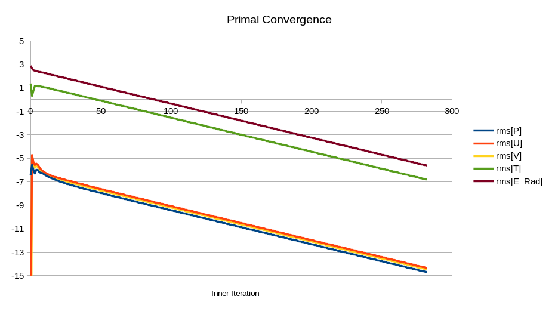
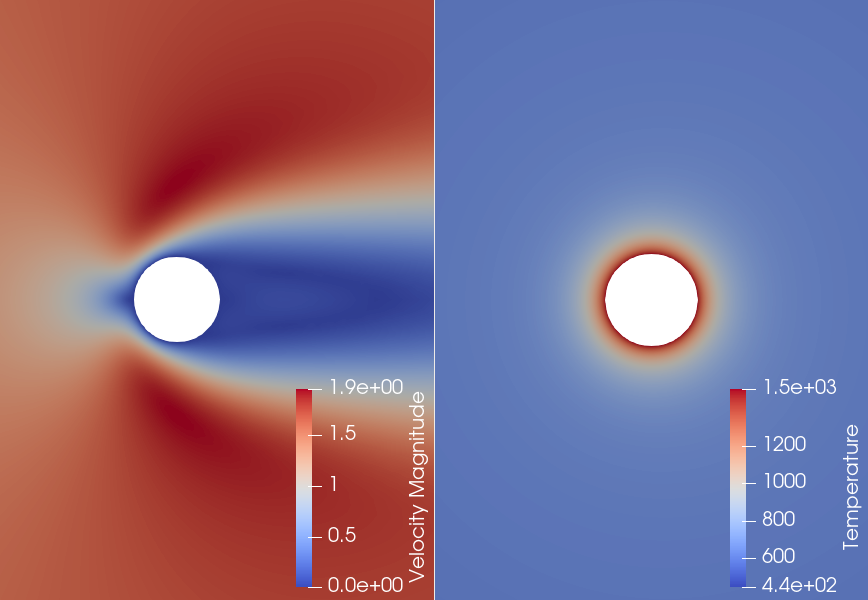
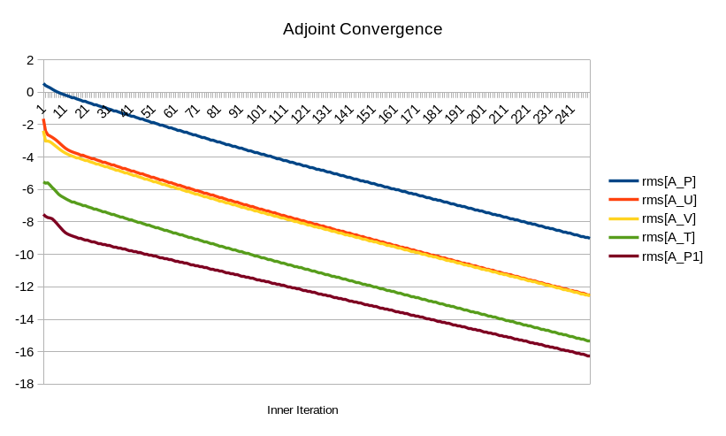
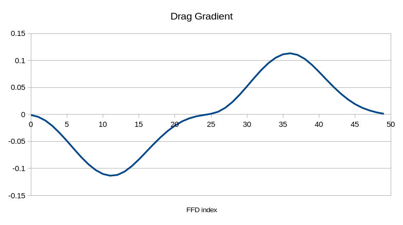

### Goals

This tutorial follows up the coupled SU2's [incompressible CFD-RHT tutorial](../Basic_RHT), extending the capabilities to the coupled adjoint computation. Upon the completion of this example, the user will be capable of
- Controlling the convergence with Cauchy criteria
- Computing coupled adjoint solutions of problems involving incompressible flow and radiation
- Generating an FFD box for a problem of external aerodynamics
- Projecting the surface sensitivities into the FFD parameters


In this tutorial, we define a problem similar to the [Laminar_Cylinder](../Laminar_Cylinder) tutorial, however using in this case the incompressible solver. A cylinder with ```D = 1.0 m``` is immersed in a laminar, external flow with a Reynolds number ```Re = 40```. 


### Resources

For this tutorial, please download the contents of the folder [multiphysics/adjoint_rht](https://github.com/su2code/Tutorials/blob/feature_radiation/multiphysics/adjoint_rht) of the [Tutorials repository](https://github.com/su2code/Tutorials). 

### Background 

SU2 adopts a P1 model for the simulation of Radiative Heat Transfer, for which further details have been provided for the [incompressible CFD-RHT tutorial](../Basic_RHT). In this case, we will incorporate the computation of the adjoint solution for the coupled problem, which will be the main focus of this tutorial. Overall, the discrete adjoint will be computed using the fixed-point expression

$$
\mathbf{\bar{z}}^{n+1} = \frac{\partial J}{\partial \mathbf{x}}^T + \frac{\partial\mathbf{G}}{\partial \mathbf{z}}^T \mathbf{\bar{z}}^n,
$$

where $$J$$ is the objective function, $$\mathbf{G}(\cdot)$$ the fixed point iterator on the coupled CFD-RHT problem, $$\mathbf{z} = (\mathbf{w},E)$$ the extended state vector including the flow variables $$\mathbf{w}$$ and the radiative energy $$E$$ and $$\mathbf{\bar{z}}$$ its adjoint. Further detail can be found in reference$$^1$$.

#### Mesh Description

The domain is discretized with an unstructured mesh with a total of 13484 nodes and 397 nodes in the body boundary, and a farfield that is 100 radiuses away from the circular body.

#### Flow Configuration File

We start the tutorial by definining the problem as an incompressible, Navier Stokes simulation

```
SOLVER = INC_NAVIER_STOKES
```

and we set the properties for the flow to obtain a ```Re = 40``` based on the cylinder diameter. We use standard settings for the linear solver and a FDS scheme for the convective terms. The problem admits a relatively high ```CFL=1.0E4```. 

```
INC_DENSITY_MODEL = VARIABLE
INC_ENERGY_EQUATION = YES
INC_DENSITY_INIT = 0.0004 
INC_VELOCITY_INIT = ( 1.0, 0.0, 0.0 )
INC_TEMPERATURE_INIT = 300
INC_NONDIM = DIMENSIONAL

FLUID_MODEL = INC_IDEAL_GAS
SPECIFIC_HEAT_CP = 1004.703
MOLECULAR_WEIGHT = 28.96

VISCOSITY_MODEL = SUTHERLAND
MU_REF = 1.0E-5
MU_T_REF = 300.0
SUTHERLAND_CONSTANT = 110.4

CONDUCTIVITY_MODEL = CONSTANT_PRANDTL
PRANDTL_LAM = 0.072

MARKER_FAR = ( farfield )
MARKER_PLOTTING = ( body )
MARKER_MONITORING = ( body )

LINEAR_SOLVER = FGMRES
LINEAR_SOLVER_PREC = ILU
LINEAR_SOLVER_ERROR = 1E-15
LINEAR_SOLVER_ITER = 20

NUM_METHOD_GRAD = WEIGHTED_LEAST_SQUARES
CONV_NUM_METHOD_FLOW = FDS
MUSCL_FLOW = YES
SLOPE_LIMITER_FLOW = NONE
TIME_DISCRE_FLOW = EULER_IMPLICIT
CFL_NUMBER = 1.0E4
```

The domain is centered in the center of the cylinder, and we set the reference properties as

```
REF_ORIGIN_MOMENT_X = 0.00
REF_ORIGIN_MOMENT_Y = 0.00
REF_ORIGIN_MOMENT_Z = 0.00

REF_LENGTH = 1.0
REF_AREA = 1.0
```

Finally, we will be interested in the drag coefficient of the cylinder. Therefore, we will control the convergence of the problem by defining the $$C_D$$ as the main convergence parameter. We use a Cauchy criteria and determine that the problem will be considered as converged when the changes to $$C_D$$ are below 1.0E-9 for more than 50 iterations.

```
INNER_ITER = 5000

CONV_CRITERIA = CAUCHY
CONV_FIELD = DRAG
CONV_RESIDUAL_MINVAL = -8

CONV_CAUCHY_ELEMS = 50
CONV_CAUCHY_EPS = 1E-9
```

At this stage, we run the test case without any thermal effects, to verify whether the mesh is appropriate for the case at hand. We set the boundary temperature at 300K

```
MARKER_ISOTHERMAL = ( body, 300.0 )
```

And now run the simulation without radiation model enabled. We obtain

```
Simulation Run using the Single-zone Driver
+---------------------------------------------------+
|  Inner_Iter|      rms[P]|      rms[T]|          CD|
+---------------------------------------------------+
|           0|   -6.415080|   -0.935921|   34.561397|
|           1|   -6.646410|   -1.167251|   12.154547|
|           2|   -6.857411|   -1.378252|    5.701560|
|           3|   -6.930843|   -1.451684|    4.159827|
|           4|   -7.096321|   -1.617162|    3.264458|
|           5|   -7.270927|   -1.791768|    2.613077|
|           6|   -7.412334|   -1.933175|    2.212900|
|           7|   -7.520525|   -2.041366|    1.950251|
|           8|   -7.608128|   -2.128969|    1.788462|
|           9|   -7.687862|   -2.208703|    1.687670|
|          10|   -7.766279|   -2.287120|    1.623157|
...

|          82|  -17.477938|  -11.998908|    1.509865|
|          83|  -17.591619|  -12.112953|    1.509865|
|          84|  -17.697791|  -12.218540|    1.509865|
|          85|  -17.809936|  -12.330734|    1.509865|
|          86|  -17.916902|  -12.437406|    1.509865|
|          87|  -18.025352|  -12.546016|    1.509865|
|          88|  -18.136105|  -12.655410|    1.509865|
|          89|  -18.240080|  -12.761985|    1.509865|
|          90|  -18.350192|  -12.872918|    1.509865|
|          91|  -18.454120|  -12.975104|    1.509865|
|          92|  -18.557342|  -13.082067|    1.509865|
```

We observe that the resulting drag coefficient is $$C_D = 1.509865$$, which agrees well with results 

|  | $$C_D$$ |
| [Park,  J.,  Kwon,  K.,  Choi,  H. (1998)](https://doi.org/10.1007/bf02942594)| 1.51  |
| [Sen,  S.,  Mittal,  S.,  Biswas,  G., (2009)](https://doi.org/10.1017/S0022112008004904) | 1.5093 |
| [Economon, T. (2018)](https://doi.org/10.2514/6.2018-3111) | 1.507 |

#### Incorporating Radiation effects

To incorporate radiation effects, we increase the temperature of the body boundary to 1500 K

```
MARKER_ISOTHERMAL = ( body, 1500.0 )
```

Now, we follow the same approach as for the [incompressible CFD-RHT tutorial](../Basic_RHT). We define the radiative model to P1, and the absorption coefficient of the problem. Both the body and the farfield are considered emissive. Finally, the CFL number for the P1 equation is set to 1.0E4.

```
RADIATION_MODEL = P1
ABSORPTION_COEFF = 0.01
MARKER_EMISSIVITY = ( body, 1.0, farfield, 1.0 )
CFL_NUMBER_RAD = 1.0E4
```

It only remains to set the output of the problem using


```
SCREEN_OUTPUT = (INNER_ITER, RMS_PRESSURE, RMS_TEMPERATURE, RMS_RAD_ENERGY, DRAG)

OUTPUT_FILES = (RESTART, PARAVIEW)
SOLUTION_FILENAME = solution_rht
RESTART_FILENAME = restart_rht
VOLUME_FILENAME = volume_rht

TABULAR_FORMAT = CSV
CONV_FILENAME= history
```

Follow the links provided to download the [config](https://github.com/su2code/Tutorials/blob/feature_radiation/multiphysics/adjoint_rht/config_rht_primal.cfg) and [mesh](https://github.com/su2code/Tutorials/blob/feature_radiation/multiphysics/radiation/mesh_adjoint_rht.su2) files.

Execute the code with the standard command

```
$ SU2_CFD config_rht_primal.cfg
```

which will show the following convergence history:

```
+----------------------------------------------------------------+
|  Inner_Iter|      rms[P]|      rms[T]|  rms[E_Rad]|          CD|
+----------------------------------------------------------------+
|           0|   -6.415080|    1.372397|    2.891724|   66.901414|
|           1|   -5.565021|    0.322939|    2.658304|    5.940759|
|           2|   -5.984899|    0.770693|    2.514670|   -6.198429|
|           3|   -6.294298|    1.163968|    2.470076|   -6.175578|
|           4|   -5.963378|    1.169388|    2.439879|   -4.752942|
|           5|   -6.001536|    1.157978|    2.410318|   -3.907486|
|           6|   -6.141469|    1.150189|    2.381443|   -3.502636|
|           7|   -6.218988|    1.125991|    2.352114|   -3.104089|
|           8|   -6.255746|    1.103723|    2.323083|   -2.641888|
|           9|   -6.313092|    1.077849|    2.293892|   -2.169670|
|          10|   -6.395249|    1.052317|    2.264864|   -1.726404|

...
|         272|  -14.409785|   -6.525393|   -5.330613|    2.768221|
|         273|  -14.437955|   -6.555088|   -5.359712|    2.768221|
|         274|  -14.467762|   -6.583369|   -5.388589|    2.768221|
|         275|  -14.495931|   -6.613064|   -5.417688|    2.768221|
|         276|  -14.525739|   -6.641345|   -5.446565|    2.768221|
|         277|  -14.553908|   -6.671040|   -5.475664|    2.768221|
|         278|  -14.583715|   -6.699321|   -5.504541|    2.768221|
|         279|  -14.611885|   -6.729016|   -5.533640|    2.768221|
|         280|  -14.641693|   -6.757297|   -5.562517|    2.768221|
|         281|  -14.669862|   -6.786992|   -5.591616|    2.768221|
|         282|  -14.699669|   -6.815274|   -5.620493|    2.768221|

```

The code is stopped as soon as the cauchy criteria set for $$C_D$$ has been met 

```
All convergence criteria satisfied.
+-----------------------------------------------------------------------+
|      Convergence Field     |     Value    |   Criterion  |  Converged |
+-----------------------------------------------------------------------+
|                  Cauchy[CD]|   9.39203e-10|       < 1e-09|         Yes|
+-----------------------------------------------------------------------+
```

And we observe that the higher temperature has a significant impact in the drag coefficient. The problem presents a very uniform and fast convergence, as it is shown next



The resulting velocity and temperature fields are



#### Computing the drag adjoint

Next, we will compute the adjoint of the drag coefficient. Go ahead and download the [adjoint config file](https://github.com/su2code/Tutorials/blob/feature_radiation/multiphysics/adjoint_rht/config_rht_adjoint.cfg), where you will observe there is very little change with respect to the primal case. Only the fact that we will be computing a discrete adjoint problem is specified using

```
MATH_PROBLEM = DISCRETE_ADJOINT
```

and the choice of function for which the adjoint will be computed is set by using

```
OBJECTIVE_FUNCTION = DRAG
```

The adjoint simulation requires the solution of the primal problem as an input. We define

```
SOLUTION_FILENAME = solution_rht
```

where the name of the solution of the primal is ```solution_rht.dat```. Therefore, we need to rename the restart file that we have just obtained from the primal run as ```restart_rht.dat``` &rarr; ```solution_rht.dat```.

Finally, the file names for the output of the adjoint simulation are set using

```
RESTART_ADJ_FILENAME = restart_rht_adj
VOLUME_ADJ_FILENAME = volume_rht_adj
CONV_FILENAME= history_adjoint
```

We run the discrete adjoint simulation with

```
$ SU2_CFD_AD config_rht_adjoint.cfg
```

The adjoint version of SU2 is executed, and the first output that we obtain for the solution method is as follows

```
-------------------------------------------------------------------------
Direct iteration to store the primal computational graph.
Compute residuals to check the convergence of the direct problem.
log10[U(0)]: -14.7278, log10[U(1)]: -14.3765, log10[U(2)]: -14.5019.
log10[U(3)]: -6.84497.
log10[E(rad)]: -5.64959
-------------------------------------------------------------------------
```

The solution fields have been reconstructed from the converged primal solution and read from ```solution_rht.dat```. One further primal iteration is run, which will be recorded using the AD tool [CoDiPack](https://www.scicomp.uni-kl.de/codi/), to compute the adjoint path. Therefore, the residuals printed above correspond to those of the direct iteration used for the recording. Further information on the recording process can be found on reference$$^2$$, exemplified for an FSI test case, and in reference$$^1$$.

An iterative process is then started by running in reverse mode through the adjoint path. The convergence of the adjoint variables is printed to screen:

```
+---------------------------------------------------+
|  Inner_Iter|    rms[A_P]|    rms[A_T]|   rms[A_P1]|
+---------------------------------------------------+
|           0|    0.536827|   -5.533690|   -7.531835|
|           1|    0.408385|   -5.610806|   -7.654074|
|           2|    0.335350|   -5.589543|   -7.728060|
|           3|    0.269327|   -5.721695|   -7.755364|
|           4|    0.187740|   -5.874327|   -7.802688|
|           5|    0.104252|   -6.001200|   -7.932024|
|           6|    0.033401|   -6.154544|   -8.079773|
|           7|   -0.027314|   -6.300318|   -8.234414|
|           8|   -0.082738|   -6.400961|   -8.389625|
|           9|   -0.134240|   -6.479417|   -8.539712|
|          10|   -0.183190|   -6.556494|   -8.661314|

...

|         238|   -8.673651|  -15.009655|  -15.952779|
|         239|   -8.707716|  -15.043698|  -15.984012|
|         240|   -8.741777|  -15.077716|  -16.015307|
|         241|   -8.775835|  -15.111755|  -16.046587|
|         242|   -8.809889|  -15.145764|  -16.077962|
|         243|   -8.843942|  -15.179796|  -16.109124|
|         244|   -8.877993|  -15.213834|  -16.140440|
|         245|   -8.912040|  -15.247850|  -16.171762|
|         246|   -8.946085|  -15.281872|  -16.202980|
|         247|   -8.980126|  -15.315881|  -16.234266|
|         248|   -9.014163|  -15.349893|  -16.265597|

```

Some convergence properties of the primal problem are inherited in the adjoint run, as further explained by Albring _et al_$$^3$$. This can be observed in the convergence of the adjoint variables



#### FFD Box

Now, we want to convert the solution of our adjoint problem into usable magnitudes for a shape optimization problem. In order to do so, we will define a Free-Form Deformation (FFD) box around the body such as


where the design parameters $$x_1$$ to $$x_{50}$$ correspond to the vertical deformation of the FFD box for 50 nodes.

In order to build the FFD box, please download the [FFD config file](https://github.com/su2code/Tutorials/blob/feature_radiation/multiphysics/adjoint_rht/config_rht_ffd.cfg). First, we need to define the mesh file as the input, and we choose the name for the resulting mesh file that will include the FFD box information to be ```mesh_adjoint_rht_ffd.su2```:

```
MESH_FORMAT = SU2
MESH_FILENAME = mesh_adjoint_rht.su2
MESH_OUT_FILENAME = mesh_adjoint_rht_ffd.su2
```

The code requires all boundaries to be indicated in the config file, it is sufficient if we use 

```
MARKER_CUSTOM = ( body, farfield )
```

to indicate SU2 that there are 2 boundaries, ```body``` and ```farfield``` in our mesh file. Next, we set up the keyword

```
DV_KIND = FFD_SETTING
```

to determine that the objective of this config file is to set up an FFD box. The boundary for which the FFD box is ```body```, and we are interested in having 24 boxes in x direction and 1 box in y direction according to our definition above, that will move in direction (0,1)

```
DV_MARKER = ( body )
DV_PARAM = ( MAIN_BOX, 24, 1, 0.0, 1.0 )
```

The FFD box will range in $$x \in [-0.55, 0.55]$$, and in $$y \in [-0.55, 0.55]$$. There is no dimension $z$ as we are solving a 2D problem.

```
FFD_DEFINITION = (MAIN_BOX, -0.55, -0.55, 0.0, 0.55, -0.55, 0.0, 0.55, 0.55, 0.0, -0.55, 0.55, 0.0, 0.0, 0.0, 0.0, 0.0, 0.0, 0.0, 0.0, 0.0, 0.0, 0.0, 0.0, 0.0)
```

Finally, the parameters for the computation of the FFD box are set.

```
FFD_TOLERANCE = 1E-8
FFD_ITERATIONS = 500
FFD_DEGREE = ( 24, 1, 0)
FFD_CONTINUITY = 2ND_DERIVATIVE
```

We run the following command

```
$ SU2_DEF config_rht_ffd.cfg
```

which returns

```
----------------------- Write deformed grid files -----------------------
|SU2 mesh                           |mesh_adjoint_rht_ffd.su2           |
Adding any FFD information to the SU2 file.
```

In order to confirm that the FFD information has been added to the mesh file, we open ```mesh_adjoint_rht_ffd.su2``` and check that the FFD information is appended below

```
FFD_NBOX= 1
FFD_NLEVEL= 1
FFD_TAG= MAIN_BOX
FFD_LEVEL= 0
FFD_DEGREE_I= 24
FFD_DEGREE_J= 1
FFD_BLENDING= BEZIER
FFD_PARENTS= 0
FFD_CHILDREN= 0
FFD_CORNER_POINTS= 4
-0.55	-0.55
0.55	-0.55
0.55	0.55
-0.55	0.55
FFD_CONTROL_POINTS= 100
0	0	0	-0.55	-0.55	-0.5
0	0	1	-0.55	-0.55	0.5
0	1	0	-0.55	0.55	-0.5
0	1	1	-0.55	0.55	0.5
...
24	0	0	0.55	-0.55	-0.5
24	0	1	0.55	-0.55	0.5
24	1	0	0.55	0.55	-0.5
24	1	1	0.55	0.55	0.5
FFD_SURFACE_POINTS= 396
body	0	4.545454545454555e-02	5.000000000000000e-01	5.000000000000000e-01
body	20	4.551176014851176e-02	5.072118017603070e-01	5.000000000000000e-01
body	21	4.568338982691677e-02	5.144217879880573e-01	5.000000000000000e-01
body	22	4.596939128289383e-02	5.216281436075275e-01	5.000000000000000e-01
...
body	409	4.596939127778600e-02	4.783718564996967e-01	5.000000000000000e-01
body	410	4.568338982421771e-02	4.855782120969652e-01	5.000000000000000e-01
body	411	4.551176014774048e-02	4.927881982883025e-01	5.000000000000000e-01
```

#### FFD Projection

Finally, we project the solution we obtained from the adjoint simulation into the design parameters of the FFD box. Starting from the [adjoint config file](https://github.com/su2code/Tutorials/blob/feature_radiation/multiphysics/adjoint_rht/config_rht_adjoint.cfg), only minor modifications are required to run the projection, which have been included to the [projection config file](https://github.com/su2code/Tutorials/blob/feature_radiation/multiphysics/adjoint_rht/config_rht_project.cfg).

First, it is necessary to use the mesh that includes the FFD information

```
MESH_FILENAME = mesh_adjoint_rht_ffd.su2
MESH_FORMAT = SU2
```

The code will read the adjoint solution computed in the previous steps. The name of the solution file for the adjoint is set as

```
SOLUTION_ADJ_FILENAME = solution_rht_adj
```

and we need to rename the restart file from the adjoint run as ```restart_rht_adj_cd.dat``` &rarr; ```solution_rht_adj_cd.dat```. Note that the objective function ```cd``` is appended to the filename.


Next, the information on Design Variables (DV) is provided. We need to indicate that all 50 points correspond to an ```FFD_CONTROL_POINT_2D``` and refer to the marker ```body```. 

```
DV_KIND = FFD_CONTROL_POINT_2D, FFD_CONTROL_POINT_2D, ..., FFD_CONTROL_POINT_2D, FFD_CONTROL_POINT_2D, 
DV_MARKER = ( ( body ) )
```

The FFD parameters are indicated in structures of the form 

```(BOX NAME, X-INDEX, Y-INDEX, X-DISP, Y-DISP)```, 

separated by semicolons. In this case, we have 25 positions in X direction, $$[0,24]$$$, and only 2 in Y direction, $$[0,1]$$$, and their range of movement is only allowed in Y direction ```X-DISP = 0.0```, ```Y-DISP = 1.0```

```
DV_PARAM = ( MAIN_BOX, 0.0, 0.0, 0.0, 1.0) ; ( MAIN_BOX, 1.0, 0.0, 0.0, 1.0) ;  ...  ; ( MAIN_BOX, 23.0, 0.0, 0.0, 1.0) ; ( MAIN_BOX, 24.0, 0.0, 0.0, 1.0) ; ( MAIN_BOX, 0.0, 1.0, 0.0, 1.0) ; ( MAIN_BOX, 1.0, 1.0, 0.0, 1.0) ; ... ; ( MAIN_BOX, 23.0, 1.0, 0.0, 1.0) ; ( MAIN_BOX, 24.0, 1.0, 0.0, 1.0) 
```

Finally, we need to provide a value to the 50 design points. Initially, we project the gradients for the undeformed FFD box

```
DV_VALUE = 0.0, 0.0, ..., 0.0, 0.0
```

Running the code with

```
$ SU2_DOT_AD config_rht_project.cfg
```

we obtain the following printout to screen

```
----------------- FFD technique (parametric -> cartesian) ---------------
Checking FFD box dimension.
Checking FFD box intersections with the solid surfaces.
SU2 is fixing the planes to maintain a continuous 2nd order derivative.
Update cartesian coord        | FFD box: MAIN_BOX. Max Diff: 1.04738e-15.

Design variable (FFD_CONTROL_POINT_2D) number 0.
DRAG gradient : -0.000954173
-------------------------------------------------------------------------

Design variable (FFD_CONTROL_POINT_2D) number 1.
DRAG gradient : -0.00432376
-------------------------------------------------------------------------

...

-------------------------------------------------------------------------

Design variable (FFD_CONTROL_POINT_2D) number 48.
DRAG gradient : 0.00391057
-------------------------------------------------------------------------

Design variable (FFD_CONTROL_POINT_2D) number 49.
DRAG gradient : 0.00131275
-------------------------------------------------------------------------
```

To finalize this tutorial, the sensitivities for the FFD points are written to the file ```of_grad.dat``` and are plotted next



### References

$$^1$$ Sanchez, R. _et al._ (2020), Adjoint-based sensitivity analysis in high-temperaturefluid flows with participating media, _(Submitted to) Modeling, Simulation and Optimization in the Health- and Energy-Sector, SEMA SIMAI SPRINGER SERIES_

$$^2$$ Sanchez, R. _et al._ (2018), [Coupled Adjoint-Based Sensitivities in Large-Displacement Fluid-Structure Interaction using Algorithmic Differentiation](https://spiral.imperial.ac.uk/handle/10044/1/51023), _Int J Numer Meth Engng, Vol 111, Issue 7, pp 1081-1107_. DOI: [10.1002/nme.5700](https://doi.org/10.1002/nme.5700)

$$^3$$ Albring, T. _et al._ (2015): Development of a consistent discrete adjoint solver in an evolving aerodynamic design framework, _AIAA paper 2015-3240_ DOI: [10.2514/6.2015-3240](https://doi.org/10.2514/6.2015-3240)

### Attribution

If you are using this content for your research, please kindly cite the following reference in your derived works (reference$$^1$$ in the text above):

Sanchez, R. _et al._ (2020), Adjoint-based sensitivity analysis in high-temperaturefluid flows with participating media, _(Submitted to) Modeling, Simulation and Optimization in the Health- and Energy-Sector, SEMA SIMAI SPRINGER SERIES_

<dl>
This work is licensed under a <a rel="license" href="http://creativecommons.org/licenses/by/4.0/">Creative Commons Attribution 4.0 International License</a>
<br />
<a rel="license" href="http://creativecommons.org/licenses/by/4.0/"></a>
</dl>

