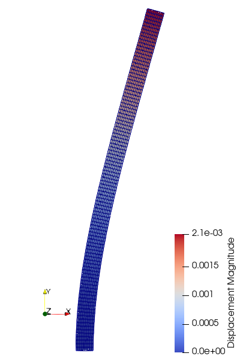
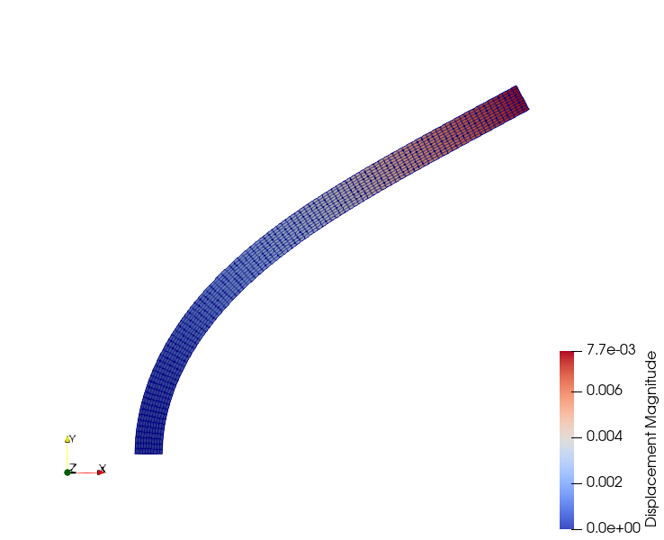

| Written by | for Version | Revised by | Revision date | Revised version | 
| --- | --- | --- | --- | --- |
| [@rsanfer](https://github.com/rsanfer) | 7.0.1 | [@rsanfer](https://github.com/rsanfer) | Jan 29, 2020 | 7.0.1 |

###### **At one glance** 

###### Solver: ```ELASTICITY```
###### Uses: ```SU2_CFD```
###### Complexity: <span style="color: green;">**Basic**</span> 
###### Prerequisites: [**Linear Elasticity**](../Linear_Elasticity/)


### Goals

Once completed the tutorial on [Linear Elasticity](../Linear_Elasticity/), we can move on to non-linear problems. This document will guide you throught the following capabilities of SU2:
- Setting up a non-linear structural problem with large deformations
- Non-linear (hyperelastic) material law
- Follower boundary conditions
- Incremental loads

In this tutorial, we use the same problem definition as for the linear elastic case: a vertical, slender cantilever, clamped in its base, and subject to a horizontal, follower load $$P$$ on its left boundary. This is shown in Fig. 1.


### Resources

You can find the resources for this tutorial in the same [structural_mechanics/cantilever](https://github.com/rsanfer/Tutorials/blob/master/structural_mechanics/cantilever) folder in the [Tutorials repository](https://github.com/rsanfer/Tutorials). You can reuse the mesh file [mesh_cantilever.su2](https://github.com/rsanfer/Tutorials/blob/master/structural_mechanics/cantilever/mesh_cantilever.su2)
from the Linear Elasticity tutorial, but you will need a new config file, [config_nonlinear.cfg](https://github.com/rsanfer/Tutorials/blob/master/structural_mechanics/cantilever/config_nonlinear.cfg).

### Background

SU2 has been designed using a finite-deformation framework$$^1$$ to account for geometrical and material non-linearities. 

We can write the non-linear structural problem via the residual equation

$$\mathscr{S}(\mathbf{u}) = \mathbf{T}(\mathbf{u}) - \mathbf{F}_b - \mathbf{F}_{\Gamma}(\mathbf{u})$$

which has been obtained from the weak formulation of the structural problem defined using the principle of virtual work and discretized using FEM. The state variable $$\mathbf{u}$$ corresponds to the displacements of the structure with respect to its reference configuration $$\mathbf{R}$$. $$\mathbf{T}(\mathbf{u})$$ are the internal equivalent forces, $$\mathbf{F}_b$$ are the body forces and $$\mathbf{F}_{\Gamma}(\mathbf{u})$$ are the surface forces applied over the external boundaries of the structure. 

We can linearize the structural equation as

$$\mathscr{S}(\mathbf{u}) + \frac{\partial \mathscr{S}(\mathbf{u})}{\partial \mathbf{u}} \Delta \mathbf{u} = \mathbf{0}$$

where the tangent matrix is $$\mathbf{K} = \partial \mathscr{S}(\mathbf{u})/\partial \mathbf{u}$$. The linearized problem is solved using a Newton method until convergence. Further description of the approach adopted in SU2 can be found in a [paper](https://doi.org/10.1002/nme.5700) by Sanchez _et al_$$^2$$.

#### Mesh Description

The cantilever is discretized using 1000 4-node quad elements with linear interpolation. The boundaries are defined as follows:


#### Configuration File Options

We start the tutorial by definining the structural properties. In this case, we will solve a geometrically non-linear problem, with a Neo-Hookean material model. 

```
GEOMETRIC_CONDITIONS= LARGE_DEFORMATIONS
MATERIAL_MODEL= NEO_HOOKEAN
```

We adopt a **plane strain** formulation for the 2D problem, and reduce the stiffness of the cantilever by 2 orders of magnitude as compared to the [Linear Elasticity](../Linear_Elasticity/) tutorial, so that the beam undergoes large deformations:

```
ELASTICITY_MODULUS=5E7
POISSON_RATIO=0.35
FORMULATION_ELASTICITY_2D = PLANE_STRAIN
```

Now, we define the Newton-Raphson strategy to solve the non-linear problem. We set the solution method and maximum number of subiterations using

```
NONLINEAR_FEM_SOLUTION_METHOD = NEWTON_RAPHSON
INNER_ITER = 15
```

Then, the convergence criteria is set to evaluate the norm of the displacement vector (```RMS_UTOL```), the residual vector (```RMS_RTOL```) and the energy (```RMS_ETOL```). We set the convergence values to -8.0, which is the log<sub>10</sub> of the previously defined magnitudes.

```
CONV_FIELD= RMS_UTOL, RMS_RTOL, RMS_ETOL
CONV_RESIDUAL_MINVAL= -8,
```

Finally, we define the boundary conditions. In this case, the load applied to the ```left``` boundary will be an uniform, _follower_ pressure, that is, its direction will change with the changes in the normals of the surface. This is done as

```
MARKER_CLAMPED = ( clamped )
MARKER_PRESSURE = ( left, 1E3, upper, 0, right, 0)
```

### Running SU2

Follow the links provided to download the [config](https://github.com/rsanfer/Tutorials/blob/master/structural_mechanics/cantilever/config_nonlinear.cfg) and [mesh](https://github.com/rsanfer/Tutorials/blob/master/structural_mechanics/cantilever/mesh_cantilever.su2) files. Execute the code with the standard command

```
SU2_CFD config_nonlinear.cfg
```

which will show the following convergence history:

```
+----------------------------------------------------------------+
|  Inner_Iter|      rms[U]|      rms[R]|      rms[E]|    VonMises|
+----------------------------------------------------------------+
|           0|   -1.454599|   -0.001635|   -2.082200|  1.1259e+06|
|           1|   -2.406133|    3.664361|   -0.038068|  1.1224e+06|
|           2|   -3.623182|    2.288350|   -2.827362|  1.1053e+06|
|           3|   -3.096627|   -0.433125|   -5.369087|  1.1229e+06|
|           4|   -4.547761|    0.493533|   -6.401479|  1.1222e+06|
|           5|   -5.306858|   -2.420278|   -9.740703|  1.1221e+06|
|           6|   -6.878854|   -3.854770|  -12.877010|  1.1221e+06|
|           7|   -8.478641|   -6.065417|  -16.078409|  1.1221e+06|
|           8|  -10.081222|   -7.667567|  -19.283559|  1.1221e+06|
|           9|  -11.683669|   -8.697378|  -22.488189|  1.1221e+06|
```

The code is stopped as soon as the values of ```rms[U]```, ```rms[R]``` and ```rms[E]``` are below the convergence criteria set in the config file. The displacement field obtained in _nonlinear.vtk_ is shown below:



### Increasing the load

The magnitude of the residual can limit the convergence of the solver, particularly for those cases in which the problem is very non-linear. Say, for example, that we multiply the load in the ```left``` boundary by 4, using

```
MARKER_PRESSURE = ( left, 4E3, upper, 0, right, 0)
```

Running SU2 now would result in the divergence of the solver,

```
+----------------------------------------------------------------+
|  Inner_Iter|      rms[U]|      rms[R]|      rms[E]|    VonMises|
+----------------------------------------------------------------+
|           0|   -0.852539|    0.600425|   -0.878080|  4.5753e+06|
|           1|   -1.130461|    4.628370|    2.207826|  4.4618e+06|
|           2|   -2.198592|    4.658260|    1.539054|  2.8742e+08|
|           3|        -nan|        -nan|        -nan|  0.0000e+00|
|           4|        -nan|        -nan|        -nan|  0.0000e+00|

```

due to a large imbalance between the internal and external loads. It can be observed that the order of magnitude of the residual vector grows above 10<sup>4</sup>. To solve this problem, we have incorporated an incremental approach to SU2, that applies the load in linear steps,

$$\mathbf{F}_i = \frac{i}{N}\mathbf{F}$$

where $$i$$ is the step and $$N$$ the maximum number of increments allowed. To apply the load in increments, we need to use the following commands

```
INCREMENTAL_LOAD = YES
NUMBER_INCREMENTS = 25
INCREMENTAL_CRITERIA = (2.0, 2.0, 2.0)
```

where $$N$$ = 25, and the criteria to apply the increments is that either one of ```rms[U] > 2.0```, ```rms[R] > 2.0``` or ```rms[E] > 2.0``` is met. We add an option to print out the load increment to the screen output:

```
SCREEN_OUTPUT = (INNER_ITER, LOAD_INCREMENT, RMS_UTOL, RMS_RTOL, RMS_ETOL, VMS)
```

If we now run the code,

```
+-----------------------------------------------------------------------------+
|  Inner_Iter|     Load[%]|      rms[U]|      rms[R]|      rms[E]|    VonMises|
+-----------------------------------------------------------------------------+
|           0|     100.00%|   -0.852539|    0.600425|   -0.878080|  4.5753e+06|
|           1|     100.00%|   -1.130461|    4.628370|    2.207826|  4.4618e+06|

Incremental load: increment 1
+-----------------------------------------------------------------------------+
|  Inner_Iter|     Load[%]|      rms[U]|      rms[R]|      rms[E]|    VonMises|
+-----------------------------------------------------------------------------+
|           0|       4.00%|   -2.250479|   -0.797515|   -3.673960|  1.7944e+05|
|           1|       4.00%|   -4.005792|    2.096002|   -3.207727|  1.7948e+05|
|           2|       4.00%|   -5.555428|   -0.881184|   -9.113457|  1.7949e+05|
|           3|       4.00%|   -7.611025|   -4.228316|  -14.254076|  1.7949e+05|
|           4|       4.00%|  -10.343696|   -7.532184|  -19.528442|  1.7949e+05|
|           5|       4.00%|  -13.138042|   -8.791438|  -24.949847|  1.7949e+05|

```

given that ```4.628370 > 2.0``` and ```2.207826 > 2.0```, the load is applied in $$\Delta \mathbf{F} = 1/25 \mathbf{F}$$, completing the simulation in the 25th step,

```
Incremental load: increment 25
+-----------------------------------------------------------------------------+
|  Inner_Iter|     Load[%]|      rms[U]|      rms[R]|      rms[E]|    VonMises|
+-----------------------------------------------------------------------------+
|           0|     100.00%|   -2.188244|   -0.786306|   -3.616397|  4.2701e+06|
|           1|     100.00%|   -3.417010|    2.241142|   -2.911125|  4.2325e+06|
|           2|     100.00%|   -2.802795|   -0.383540|   -4.853108|  4.1931e+06|
|           3|     100.00%|   -3.461966|    1.059169|   -5.203155|  4.2102e+06|
|           4|     100.00%|   -4.053497|   -0.412173|   -7.024221|  4.2103e+06|
|           5|     100.00%|   -4.505028|   -1.211625|   -8.188042|  4.2090e+06|
|           6|     100.00%|   -5.044900|   -2.434771|   -9.288963|  4.2093e+06|
|           7|     100.00%|   -5.572267|   -3.418852|  -10.345812|  4.2092e+06|
|           8|     100.00%|   -6.099258|   -4.140827|  -11.400141|  4.2093e+06|
|           9|     100.00%|   -6.625915|   -4.693663|  -12.453409|  4.2093e+06|
|          10|     100.00%|   -7.152645|   -5.224056|  -13.506885|  4.2093e+06|
|          11|     100.00%|   -7.679350|   -5.750731|  -14.560291|  4.2093e+06|
|          12|     100.00%|   -8.206063|   -6.277523|  -15.613718|  4.2093e+06|
|          13|     100.00%|   -8.732773|   -6.804154|  -16.667138|  4.2093e+06|
|          14|     100.00%|   -9.259484|   -7.329682|  -17.720560|  4.2093e+06|
|          15|     100.00%|   -9.786195|   -7.846390|  -18.773983|  4.2093e+06|
|          16|     100.00%|  -10.312907|   -8.293905|  -19.827405|  4.2093e+06|
```

The displacement field is now



### References
$$^1$$ Bonet, J. and Wood, R.D. (2008), Nonlinear Continuum Mechanics for Finite Element Analysis, _Cambridge University Press_

### Attribution

If you are using this content for your research, please kindly cite the following reference (reference $$^2$$ in the text above) in your derived works:

Sanchez, R. _et al._ (2018), [Coupled Adjoint-Based Sensitivities in Large-Displacement Fluid-Structure Interaction using Algorithmic Differentiation](https://spiral.imperial.ac.uk/handle/10044/1/51023), _Int J Numer Meth Engng, Vol 111, Issue 7, pp 1081-1107_. DOI: [10.1002/nme.5700](https://doi.org/10.1002/nme.5700)

<dl>
This work is licensed under a <a rel="license" href="http://creativecommons.org/licenses/by/4.0/">Creative Commons Attribution 4.0 International License</a>
<br />
<a rel="license" href="http://creativecommons.org/licenses/by/4.0/"></a>
</dl>

